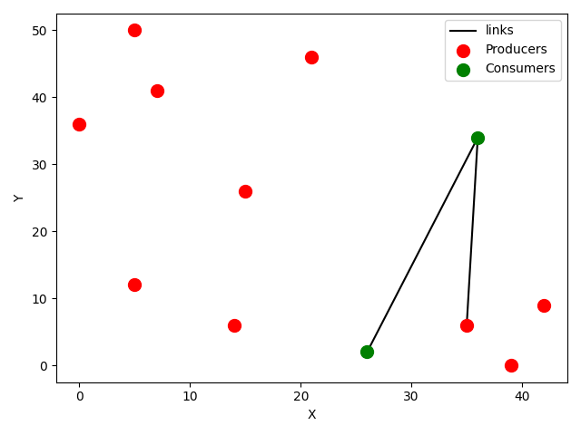

# Ant Colony Optimisation for Routing Problem in Power Systems

## Simulate optimal power flow and ideal plant placement given specific heuristic cost

### Dependencies

`pip install matplotlib`

### Usage

Run `python main.py` to generate a random graph and plot its solution.

### Example plot:

